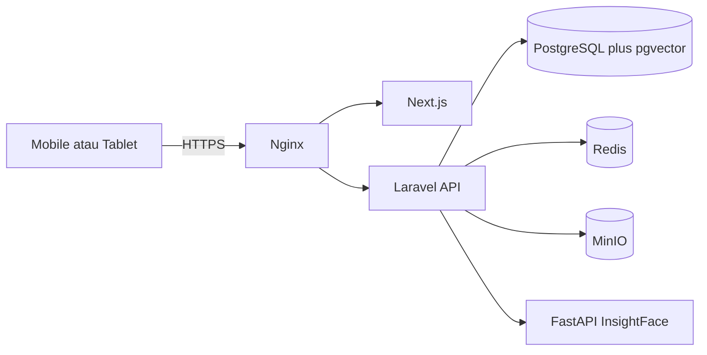
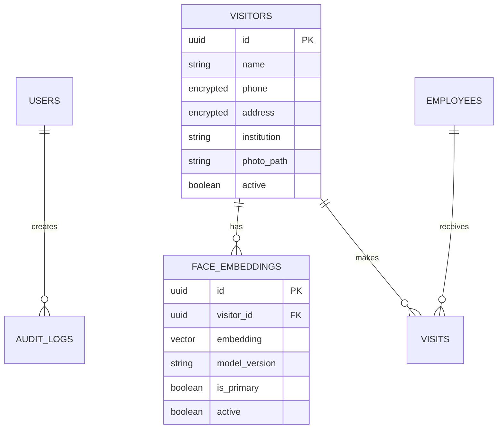
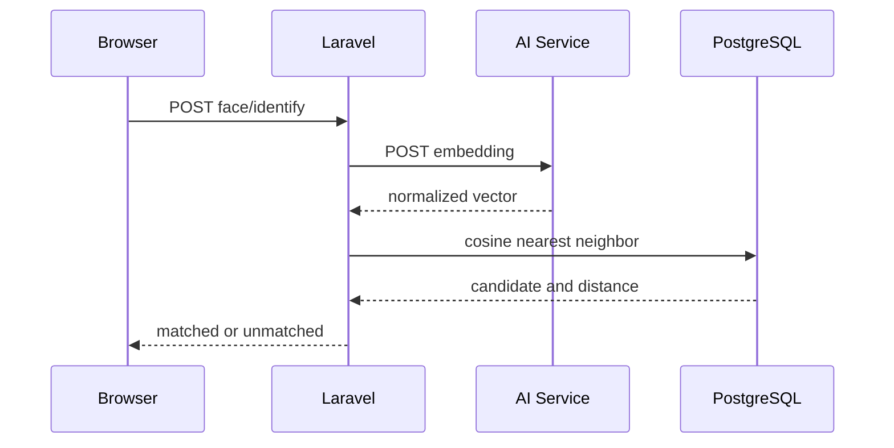

# Arsitektur Teknis

```mermaid
flowchart LR
    U[Mobile atau Tablet] -->|HTTPS| N[Nginx]
    N --> F[Next.js]
    N --> L[Laravel API]
    L --> P[(PostgreSQL plus pgvector)]
    L --> R[(Redis)]
    L --> M[(MinIO)]
    L --> A[FastAPI InsightFace]
```

```mermaid
erDiagram
    USERS ||--o{ AUDIT_LOGS : creates
    VISITORS ||--o{ FACE_EMBEDDINGS : has
    VISITORS ||--o{ VISITS : makes
    EMPLOYEES ||--o{ VISITS : receives
    VISITORS {
      uuid id PK
      string name
      encrypted phone
      encrypted address
      string institution
      string photo_path
      boolean active
    }
    FACE_EMBEDDINGS {
      uuid id PK
      uuid visitor_id FK
      vector embedding
      string model_version
      boolean is_primary
      boolean active
    }
```

## Sequence identifikasi

```mermaid
sequenceDiagram
    participant Browser
    participant Laravel
    participant AI as AI Service
    participant DB as PostgreSQL
    Browser->>Laravel: POST face/identify
    Laravel->>AI: POST embedding
    AI-->>Laravel: normalized vector
    Laravel->>DB: cosine nearest neighbor
    DB-->>Laravel: candidate and distance
    Laravel-->>Browser: matched or unmatched
```
